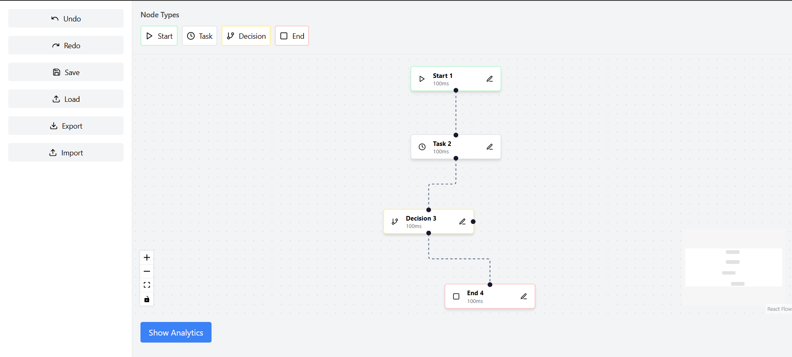
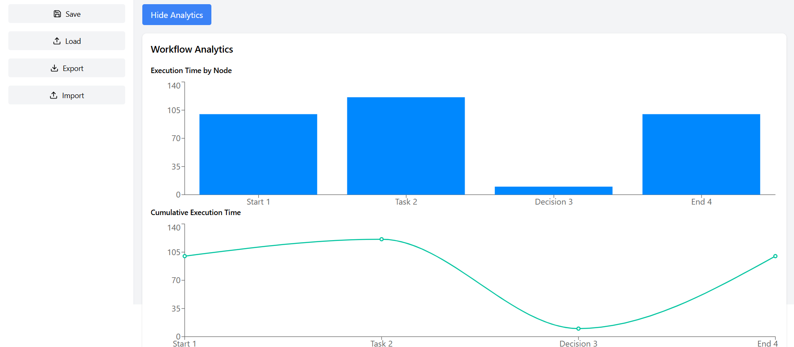

## Overview

This project is a workflow visualization tool built with React, TypeScript, and React Flow. It allows users to create, edit, and visualize workflow processes using a drag-and-drop interface.

## Usage

1. Drag and drop nodes to the canvas.
2. Click on a node to open the form and edit its properties.
3. Save your changes to local storage to prevent data loss on page refresh.

## Live Demo

Check out the live demo here: https://workflowreact.vercel.app/

# Workflow Visualization Tool

