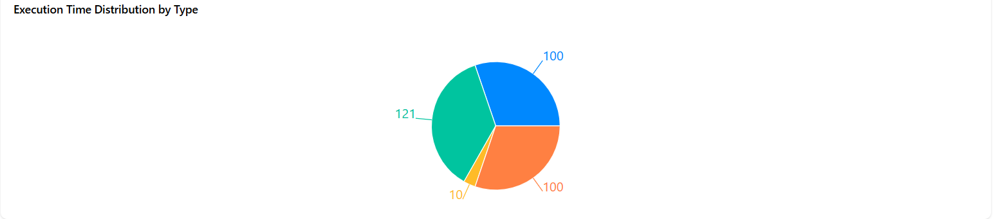

## Overview

This project is a workflow visualization tool built with React, TypeScript, and React Flow. It allows users to create, edit, and visualize workflow processes using a drag-and-drop interface.

# Workflow Visualization Tool

